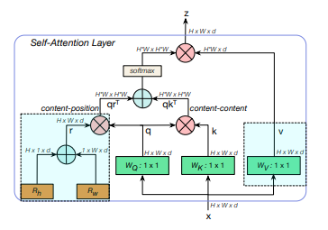
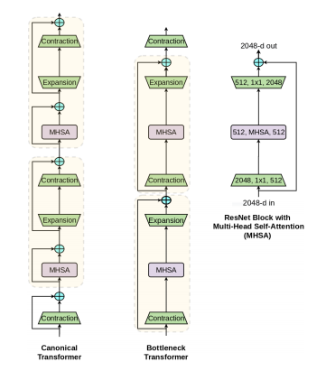

</img>

</img>

## Bottleneck Transformer - Pytorch

[](https://badge.fury.io/py/bottleneck-transformer-pytorch)

Implementation of <a href="https://arxiv.org/abs/2101.11605">Bottleneck Transformer</a>, SotA visual recognition model with convolution + attention that outperforms EfficientNet and DeiT in terms of performance-computes trade-off, in Pytorch

## Install

```bash
$ pip install bottleneck-transformer-pytorch
```

## Usage

```python
import torch
from torch import nn
from bottleneck_transformer_pytorch import BottleStack

layer = BottleStack(
    dim = 256,              # channels in
    fmap_size = 64,         # feature map size
    dim_out = 2048,         # channels out
    proj_factor = 4,        # projection factor
    downsample = True,      # downsample on first layer or not
    heads = 4,              # number of heads
    dim_head = 128,         # dimension per head, defaults to 128
    rel_pos_emb = False,    # use relative positional embedding - uses absolute if False
    activation = nn.ReLU()  # activation throughout the network
)

fmap = torch.randn(2, 256, 64, 64) # feature map from previous resnet block(s)

layer(fmap) # (2, 2048, 32, 32)
```

## BotNet

With some simple model surgery off a resnet, you can have the 'BotNet' (what a weird name) for training.

```python
import torch
from torch import nn
from torchvision.models import resnet50

from bottleneck_transformer_pytorch import BottleStack

layer = BottleStack(
    dim = 256,
    fmap_size = 56,        # set specifically for imagenet's 224 x 224
    dim_out = 2048,
    proj_factor = 4,
    downsample = True,
    heads = 4,
    dim_head = 128,
    rel_pos_emb = True,
    activation = nn.ReLU()
)

resnet = resnet50()

# model surgery

backbone = list(resnet.children())
backbone[5:] = [layer]

model = nn.Sequential(
    *backbone,
    nn.AdaptiveAvgPool2d((1, 1)),
    nn.Flatten(1),
    nn.Linear(2048, 1000)
)

# use the 'BotNet'

img = torch.randn(2, 3, 224, 224)
preds = model(img) # (2, 1000)
```

## Citations

```bibtex
@misc{srinivas2021bottleneck,
    title   = {Bottleneck Transformers for Visual Recognition}, 
    author  = {Aravind Srinivas and Tsung-Yi Lin and Niki Parmar and Jonathon Shlens and Pieter Abbeel and Ashish Vaswani},
    year    = {2021},
    eprint  = {2101.11605},
    archivePrefix = {arXiv},
    primaryClass = {cs.CV}
}
```
